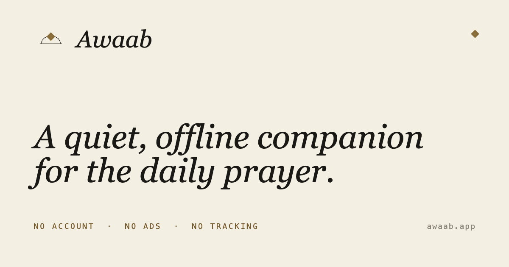

# Awaab — public site



Public marketing, support, and legal pages for **Awaab** — a quiet,
offline Islamic companion app for iPhone, iPad, and Android. Qur'an
reader, prayer times, qibla finder. Bilingual (English + Arabic).

This repository is the **static website only**. The application itself
lives in a separate, proprietary repository.

The pages here satisfy the support-URL, privacy-policy, accessibility,
and age-suitability requirements for distribution on the Apple App
Store and Google Play.

## Live

| Language | URL |
| --- | --- |
| English | <https://elshazlyyy.github.io/Awaab-Public/> |
| العربية | <https://elshazlyyy.github.io/Awaab-Public/ar/> |

## What's in the repo

```
.
├── awaab.css                  Single source of truth for tokens, type, components
├── icon.png                   App icon (favicon, apple-touch-icon, manifest icon)
├── og.png                     1200×630 social-share card (bilingual)
├── manifest.webmanifest       PWA manifest for "Add to Home Screen"
├── robots.txt                 Allow all crawlers, points at sitemap.xml
├── sitemap.xml                Eight canonical URLs with hreflang alternates
├── .nojekyll                  Tells GitHub Pages to skip Jekyll processing
│
├── index.html                 English home — hero, gallery, features, craft, verse, facts, FAQ, promise
├── privacy.html               English privacy policy
├── accessibility.html         English accessibility statement
├── age-suitability.html       English age-suitability statement
├── 404.html                   Bilingual not-found page
│
└── ar/                        Arabic mirror (right-to-left)
    ├── index.html
    ├── privacy.html
    ├── accessibility.html
    └── age-suitability.html
```

## Design system

Tokens mirror the app's `src/theme/colors.ts` and `src/theme/typography.ts`:

| Token | Value |
| --- | --- |
| Background | `#F4EFE3` (warm cream) |
| Surface (raised card) | `#FAF6EC` |
| Primary ink | `#1A1814` |
| Accent (bronze) | `#8A6E3A` |
| Hairline | `rgba(26, 24, 20, 0.10)` |

Dark theme tokens (auto-activated via `prefers-color-scheme: dark`) and
the full type scale (display-l 44/52 down to caption 11/14) live in
`awaab.css`.

Fonts: **Cormorant Garamond** (serif headings), **Inter Tight** (sans
body), **Amiri** (Arabic serif), **Cairo** (Arabic sans),
**JetBrains Mono** (numerals).

## Local preview

No build step — just open the files. From the repo root:

```bash
# Python (built into macOS)
python3 -m http.server 8000

# Or Node, if you have it
npx serve -p 8000

# Or just double-click index.html (most things work; some paths
# behave slightly differently than under a real server)
```

Then open <http://localhost:8000/> and <http://localhost:8000/ar/>.

## Deploy

Every push to `main` is auto-deployed by GitHub Pages from the repo
root. No CI, no build, no preview environments. The CDN typically
serves new content within ~30 seconds of push.

To verify a deploy:

```bash
gh api /repos/Elshazlyyy/Awaab-Public/pages/builds/latest --jq '.status'
```

## Quality

Verified at the production URL with Lighthouse:

| | Performance | Accessibility | Best Practices | SEO |
| --- | --- | --- | --- | --- |
| Desktop | 91 | 100 | 100 | 100 |
| Mobile | 71 | 100 | 100 | 100 |

Zero failed audits at either viewport. The site is fully responsive
from 320 px (iPhone SE) to wide desktop, supports dark mode via
`prefers-color-scheme`, respects `prefers-reduced-motion`, and ships
no analytics, no trackers, and no third-party scripts of any kind.

## License

Proprietary. © 2026 Ahmed Elshazly. All rights reserved.

The repository is hosted publicly so that end users and app store
reviewers can access the pages required for the application's
distribution. Public visibility does not grant any rights to copy,
fork, modify, or reuse this repository's contents. See [`LICENSE`](LICENSE)
for the full text.

## Contact

Questions, feedback, or accessibility reports: <ahmed.shazly15@gmail.com>
